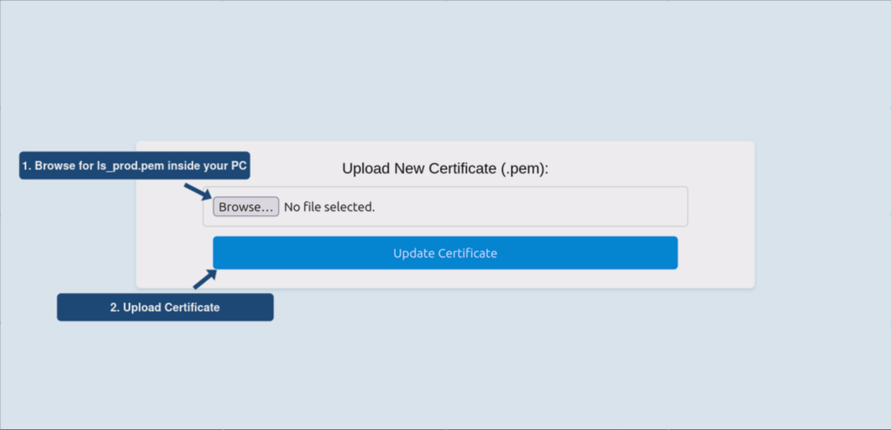
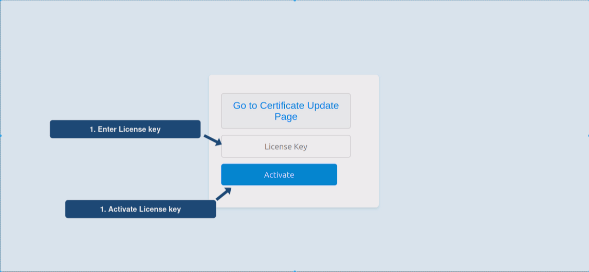

# LicenseSpring API Client with SSL/TLS Support - ESP32 board (Arduino)

This project was part of my onboarding as a **student**. The goal was to establish **HTTPS** communication with the LicenseSpring server on an ESP32 board and perform license activation and license check. The actual code is written in C++ and follows the Arduino structure.

## Key features 
**LicenseSpring API Integration**
* Directly connect with LicenseSpring's client API to activate and deactivate software licenses
* Ensuring the security of data transmission, our project utilizes HTTPS requests combined with SSL/TLS encryption. 
  
**User-Friendly Web Interface**
* Certificates are stored directly in the ESP32’s flash memory, allowing for secure and persistent storage. Users can easily upload new certificates or update existing ones via the web interface.

* Users can submit a LicenseSpring key through the web interface to activate their software license.

## Installation 

clone GitHub repo --> `git clone git@github.com:kemicar/LicenseSpring-PoC.git`

## Requirements

* **ESP32 Board**: Have your ESP32 board on hand.
* **USB Cable**: A cable to connect the ESP32 to your computer.
* **PlatformIO IDE Extension**: Install PlatformIO IDE extension in VS Code
* **[LicenseSpring account](https://licensespring.com/)**

### Libraries

Here are the required libraries:  
ArduinoJson by Benoit Blanchon: Used for JSON parsing and serialization.

    Version: 6.21.4 or newer
    PlatformIO Library ID: bblanchon/ArduinoJson@^6.21.4

CryptoSuite2 by daknuett: Provides cryptographic functions, essential for secure data handling.

    Version: 0.2.7 or newer
    PlatformIO Library ID: daknuett/cryptosuite2@^0.2.7
    
## Configuration

Inside **data folder** create config folder with **config.json** file:
* `cd data`
* `mkdir config`
* `touch config.json`

**config.json** should have:
```json
{
  "uuid": "your-LicenseSpring-uuid-here",
  "product_short_code": "your-LicenseSpring-product-short-code-here",
  "secret_key": "your-LicenseSpring-secret-key-here",
  "ssid": "your-network-ssid-here",
  "password": "your-network-password-here"
}
```

### Certificate 
Visit the LicenseSpring API:
* Go to LicenseSpring API in your web browser **https://api.licensespring.com/**.

* Download the ROOT Certificate:Look for the option to download the ROOT certificate.The certificate should be available in .pem format.

* Save the Certificate on Your PC
    * Once downloaded, save the file with the name **ls_prod.pem** on your computer.
       

**Additional Help**

How to Download a Certificate from a Web Browser:
If you're unsure how to download a certificate from a website using your browser, refer to this helpful guide: [How to Export/Download SSL Certificate from a Server/Website.](https://medium.com/@menakajain/export-download-ssl-certificate-from-server-site-url-bcfc41ea46a2)
      

## Usage

This section guides you through the steps to set up and use the software on your ESP32 board.

### Code Upload and Setup
1. **Upload Code to Your ESP32 Board**:
   - Run the following command in PlatformIO to upload the code:
     ```
     platformio run --target upload
     ```
2. **Open Serial Monitor**:
   - To view the output and interactions, open the serial monitor:
     ```
     platformio device monitor
     ```
   - After the code is uploaded, the ESP32's IP address will be displayed in the serial monitor.

3. **Access the Web Interface**:
   - Use the displayed IP address to access the ESP32's web server from your browser.

### Certificate and License Key Setup Using the Web Interface

#### Certificate Setup
1. **Navigating to Certificate Update Page**:
   - On the ESP32 web server interface, navigate to the *Certificate Update Page*.
  
   

2. **Uploading the Certificate**:
   - Upload your `ls_prod.pem` certificate file through the interface.
  
   

   - Once uploaded, the ESP32 will reboot and load the certificate from its flash memory for future use.
   - **Note**: The certificate needs to be uploaded only once; post this, it will be automatically loaded from the flash memory.

#### License Key Activation
1. **Generate a License Key**:
   - Create a key-based license on the [LicenseSpring platform](https://docs.licensespring.com/vendor-platform/issuing-new-licenses).

2. **Visit the ESP32 Server Web Interface**:
   - Navigate to the ESP32 server site using the provided IP address.

3. **Activating the License Key**:
   - Enter the License Key in the designated field and click 'Activate' to initiate the activation process.
  
   


### Simple Testing and Customization

Once the license activation process is completed, the ESP32 performs the following actions:

1. **Server Connection Closure**: The ESP32 will first close the connection to the server to finalize the license activation process.

2. **License Activation and Regular Checks**: The device then executes the license activation check and will continue to perform this check every 24 hours. This is managed by a dedicated timer set in the code.

3. **Custom Logic Integration**: After successful license activation, you can integrate your custom functionality. The provided code snippet serves as a template for adding your specific logic when the license is active:

   ```cpp
   if (state == true)
   {
     Serial.println("License is active. Custom functionality can be added here.");
     // Insert the logic for what the ESP32 should do when the license is active.
     // This is where you can expand the project's capabilities according to your needs.
     delay(3000); // Example delay; adjust or remove as needed for your application.
   } 


## APIcall Class Documentation

Inside **lib** folder there is the `APIcall` class that facilitates secure communication with an API server over HTTPS and SSL/TLS protocols, optimized for use with an ESP32 board.

## Constructor

### `APIcall`
Initializes the API client with the necessary parameters for secure communication.

#### Parameters
- `root_ca_char`: ROOT certificate for SSL/TLS communication (const char*).
- `shared_key`: Shared key for authentication (String).
- `uuid`: Unique identifier from LiceseSpring (String).
- `api_version`: LicenseSpring API version (String).
- `api_url`: Base URL of the API (String).

## Methods

### `hardware_id_setup()`
Extracts and sets up the hardware ID using the ESP32's MAC address, which serves as a unique identifier for the hardware.

### `certificate_setup()`
Configures the client with the ROOT certificate for secure HTTPS requests.

### `get_time()`
Retrieves the current UTC time from an NTP server, used in authorization headers for API communication.

### `auth_header()`
Generates authorization headers for API communication, including a signature using HMAC-SHA256.

### `add_header(HTTPClient &http, String &time, String &auth_header)`
Adds necessary headers to an HTTPClient request.

### `check_license(String product_short_code, String license_key)`
Sends a request to check  license.

### `activate_license(String product_short_code, String license_key)`
Sends a request to activate a license.

### `HMAC_SHA256_To_Base64(String secretKey, String message)`
Calculates the HMAC-SHA256 of a given message and secret key, and returns the result in Base64 format.

### `base64Encode(byte *byteArray, int len)`
Encodes a byte array into a Base64 string.

### Code sample 

```c
// Initialize APIcall instance
  api = new APIcall(certificate.c_str(), secret_key, uuid);

  // Set up hardware ID and certificate for HTTPS communication
  api->hardware_id_setup();
  api->certificate_setup();

  // activation/deactivation of license...
```

## Contact info
For any question about this PoC solution contact:
**teo.terzic@licensespring.com**

## License
This project is licensed under the Apache License 2.0 - see the [LICENSE](LICENSE.txt) file for details.


  